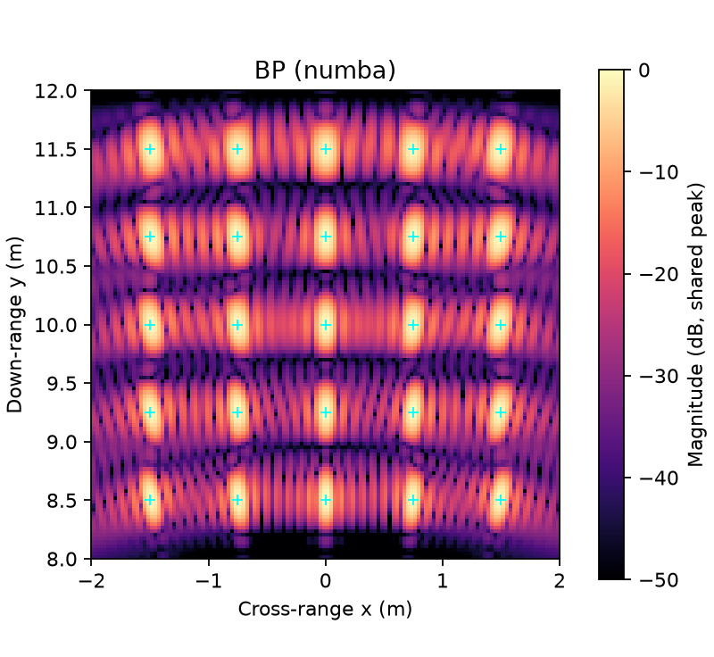
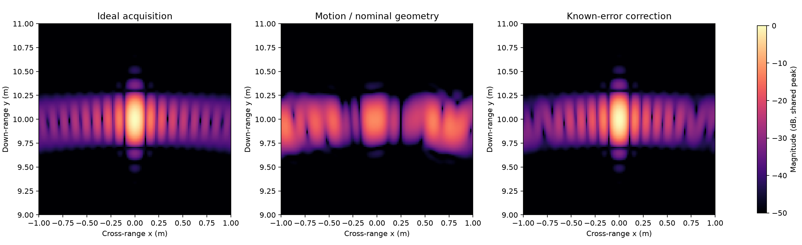

# Accelerated FMCW-SAR Imaging

A CPU-based Python pipeline for simulating FMCW radar sweeps and reconstructing
synthetic-aperture radar images. It is intended as a small numerical-computing
project that demonstrates modular data processing, correctness testing, and measured
optimization of Back-Projection (BP).

## Demo

The included example starts with a deterministic 25-point scene, generates analytic
dechirped sweeps, applies FFT range processing, and reconstructs a complex image:

```bash
python -m sar.cli reconstruct \
  --config configs/point_targets.yaml \
  --backend numba
```



The motion example generates data along a perturbed path, reconstructs it with the
nominal path, and then applies the known trajectory error:

```bash
python -m sar.cli motion-demo --config configs/motion_error.yaml
```



This is a controlled known-error experiment, not an autofocus implementation.

## Architecture

```text
YAML configuration or versioned NPZ sweeps
                    |
     scene + trajectory + signal simulation
                    |
          windowed FFT range processing
                    |
  reference / chunked NumPy / parallel Numba BP
                    |
       complex image + metrics + PNG output
```

The numerical modules do not depend on the CLI or plotting code. The CLI composes
them into four workflows: `simulate`, `reconstruct`, `motion-demo`, and `benchmark`.

## Tech Stack

- Python 3.11+
- NumPy and SciPy for array operations and FFT processing
- Numba for compiled, parallel CPU reconstruction
- Matplotlib for generated figures
- PyYAML for configuration and pytest for tests
- psutil for sampled process-memory measurements

## Key Engineering Features

- **Three compatible BP implementations.** A scalar Python version serves as the
  numerical reference. The optimized versions use bounded NumPy pixel chunks and a
  Numba kernel parallelized over independent output pixels.
- **Validated file and configuration boundaries.** Frozen configuration objects reject
  invalid values and unknown fields. The versioned NPZ format stores sweeps, antenna
  positions, and radar metadata and rejects incomplete or nonfinite inputs.
- **Reproducible benchmarks.** Each backend and workload runs in a separate process.
  The runner records warm-up, median/min/max BP time, complex relative error, thread
  count, and sampled RSS to CSV together with environment metadata.
- **Numerical checks beyond implementation agreement.** Tests cover analytic geometry,
  FFT range and phase, interpolation boundaries, a direct matched-filter comparison,
  target localization, and controlled trajectory error.

### Measured BP runtime

The saved benchmark used Python 3.13.12 on Windows, three timed repetitions, and four
Numba threads. Times are warmed **BP-only** medians and exclude simulation, FFT,
plotting, and Numba initialization.

| Backend | 512x512 grid, 64 pulses | Relative error vs. scalar reference |
|---|---:|---:|
| Scalar Python | 47.691 s | 0 |
| Chunked NumPy | 1.005 s | 1.98e-15 |
| Numba, 4 threads | 0.092 s | 2.60e-15 |

These speedups use the readable scalar Python implementation as the baseline; they
are not comparisons with optimized C++, CUDA, or another SAR package. Full results
and measurement details are in [`benchmarks/`](benchmarks/).

## Getting Started

```bash
git clone https://github.com/xiaorui7/accelerated-fmcw-sar.git
cd accelerated-fmcw-sar
python -m venv .venv
```

Activate the environment:

```bash
# Linux/macOS
source .venv/bin/activate

# Windows PowerShell
.\.venv\Scripts\Activate.ps1
```

Install and run an example:

```bash
python -m pip install -e ".[dev]"
python -m sar.cli simulate --config configs/point_targets.yaml
python -m sar.cli reconstruct \
  --config configs/point_targets.yaml \
  --input results/sweeps.npz \
  --backend numba
```

The equivalent installed entry point is `sar`. Run `sar --help` to list commands.

Run a short benchmark before the full suite:

```bash
python -m sar.cli benchmark \
  --sizes 64 128 \
  --pulses 16 32 \
  --repeats 3 \
  --output benchmarks/quick.csv
```

The default benchmark includes a slow scalar 512x512 case and can take several
minutes. Benchmark results depend on the machine, thread count, and system load.

## Tests

```bash
python -m pytest -q
```

The tests cover the numerical model, agreement among BP backends, configuration and
archive validation, motion-error behavior, CLI workflows, and benchmark artifact
generation. GitHub Actions is configured to run the suite on Python 3.11 and 3.13 on
Linux and Windows.

## Project Structure

```text
src/sar/       numerical pipeline, storage, metrics, CLI, and benchmark runner
tests/         focused unit and integration tests
configs/       reproducible single-target, multi-target, and motion examples
examples/      one-command local demo
benchmarks/    profiling script and saved machine-specific measurements
results/       selected example figures and motion metrics
docs/          numerical design, provenance, and real-data investigation
```

## Design Decisions

- **Keep a slow reference implementation.** It is easier to inspect and provides an
  oracle for optimized kernels. Agreement with it is supplemented by independent
  analytic tests because shared bugs can affect every backend.
- **Chunk vectorized work.** Processing at most 8,192 pixels at a time avoids allocating
  full pulse-by-image temporary arrays while retaining NumPy's compiled operations.
- **Parallelize independent pixels.** Each Numba worker owns one output pixel and
  accumulates pulses sequentially, avoiding shared writes and reduction races.
- **Use NPZ instead of a database.** Each experiment is a small set of homogeneous
  arrays plus metadata. A versioned archive is portable and keeps the project local;
  no query or multi-user workload justifies a database.

More detail is available in [the numerical design](docs/DESIGN.md). A module-by-module
walkthrough and interview preparation notes are in [PROJECT_GUIDE.md](PROJECT_GUIDE.md).

## Future Improvements

- Measure interpolation accuracy while varying FFT zero-padding and aperture density.
- Add a small, validated adapter for the public `fmcw3` example after documenting its
  geometry and signal convention.
- Evaluate thread count and NumPy chunk size as explicit runtime/memory trade-offs.

CUDA, fast-factorized BP, and estimated autofocus are intentionally outside the current
scope.

## Provenance

This repository develops a prior undergraduate radar topic as a new Python project
with AI-assisted implementation and review. The original MATLAB files were not
available in this workspace, so this is not presented as a verified port or as new
radar research. See [docs/PROVENANCE.md](docs/PROVENANCE.md) for the full source audit.
